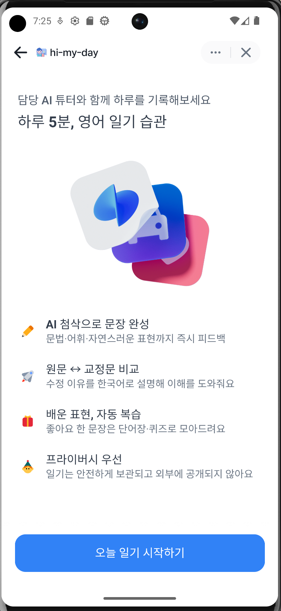
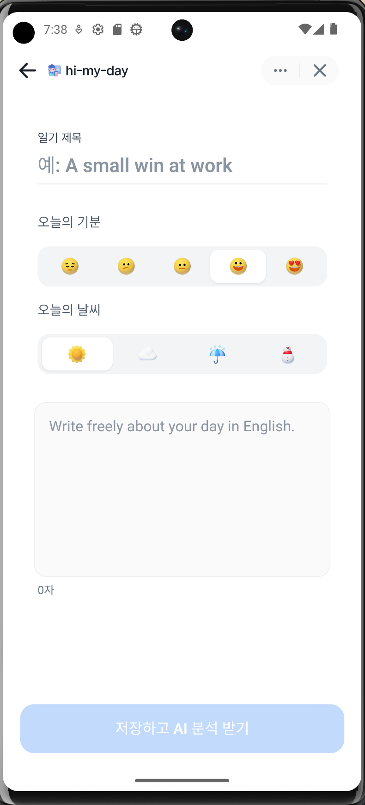

# 🪶 Hi My Day API

**Hi My Day**는 영어 일기 쓰기 서비스의 백엔드 API 서버입니다.  
사용자는 매일 영어로 일기를 작성하고, AI 분석을 통해 **교정·번역·표현 추천**을 받을 수 있습니다.  

이 저장소는 **Django REST Framework (DRF)** 기반으로 구축되었으며,  
React 프론트엔드(`hi-my-day-web`)과 REST API로 연동됩니다.


<p align="center">
  
  
  
  
</p>

---

## 🧩 Overview

| 기능 | 설명 |
|------|------|
| 📖 일기 관리 | 매일 일기 작성 / 조회 / 수정 / 삭제 |
| 🧠 AI 분석 | 영어 문법 교정, 번역, 표현 추천 |
| ☀️ 오늘의 문장 | 매일 3개의 영어 문장 슬라이드 제공 |
| 🔐 JWT 인증 | 커스텀 AppJWTAuthentication |
| 📅 캘린더 연동 | 작성된 날짜별 일기 표시 |

---
## 🏗️ Tech Stack

| Category | Stack |
|-----------|--------|
| **Language** | Python 3.12 |
| **Framework** | Django 5.x + Django REST Framework |
| **Auth** | Custom JWT (`AppJWTAuthentication`) |
| **Docs** | drf-spectacular (Swagger / OpenAPI) |
| **CORS** | django-cors-headers |
| **Env Config** | python-dotenv |
| **Database** | SQLite (dev) → MySQL (prod) |

---

## 🧭 Project Structure

```
hi-my-day-api/
├── manage.py
├── config/
│ ├── settings.py # 환경설정 (CORS, REST_FRAMEWORK 등)
│ ├── urls.py # 전역 URL 라우팅
│ └── wsgi.py / asgi.py
│
├── accounts/
│ ├── models.py # AppUser 모델
│ ├── views.py # 로그인 / JWT 발급
│ ├── serializers.py
│ ├── integrations/ # 외부 연동 (예: Toss 등)
│ └── security/
│ ├── authentication.py # AppJWTAuthentication (커스텀 인증)
│ ├── app_jwt.py # JWT 발급 / 검증 로직
│ └── models.py
│
├── entries/
│ ├── models.py # Entry (일기 / 메타 / 분석 결과)
│ ├── serializers.py # EntryCreate / EntryList / EntryDetail
│ ├── views.py # EntryViewSet / quotes()
│ ├── services.py # analyze_entry (AI 분석 더미)
│ ├── urls.py # /api/entries/ 엔드포인트
│ └── seed_entries.py # 초기 데이터 생성 스크립트
│
├── .env.example
├── requirements.txt
└── README.md
```

---

## 🌐 API Overview

| Endpoint | Method | Description |
|-----------|---------|-------------|
| `/api/entries/` | `GET` | 일기 목록 조회 |
| `/api/entries/?calendar=1&month=YYYY-MM` | `GET` | 달력용 일기 날짜 조회 |
| `/api/entries/` | `POST` | 일기 생성 |
| `/api/entries/{id}/` | `GET` | 일기 상세 조회 |
| `/api/entries/{id}/analyze/` | `POST` | AI 분석 요청 |
| `/api/entries/by-date/?date=YYYY-MM-DD` | `GET` | 특정 날짜 일기 조회 |
| `/api/quotes/` | `GET` | 오늘의 문장 3개 |
| `/api/auth/token/` | `POST` | JWT 발급 |

---

## 🔐 Authentication

`AppJWTAuthentication` (`accounts/security/authentication.py`)  
JWT 인증이 필요한 엔드포인트는 다음과 같이 요청합니다:

---

## ⚙️ Setup Guide
1️⃣ Install dependencies

```
python3.12 -m venv .venv
source .venv/bin/activate
pip install -r requirements.txt
```

2️⃣ copy .env.sample to .env and config environment variables 

3️⃣ Run migrations & seed data
```
python manage.py migrate
python entries/seed_entries.py
```
4️⃣ Run server
```
python manage.py runserver
```

➡️ Swagger UI:
http://localhost:8000/api/schema/swagger-ui/


---
```
[React Web App]
      ↓ (REST API)
[NGINX / CORS Gateway]
      ↓
[Django App (hi-my-day-api)]
  ├── accounts (JWT Auth)
  ├── entries  (CRUD + AI Analysis)
  ├── quotes   (Daily phrases)
  └── drf-spectacular (Docs)
      ↓
[Database: SQLite/MySQL]
      ↓
[Optional]
  ├── OpenAI or Claude (AI 교정)
  └── S3 / Cloud Storage
```